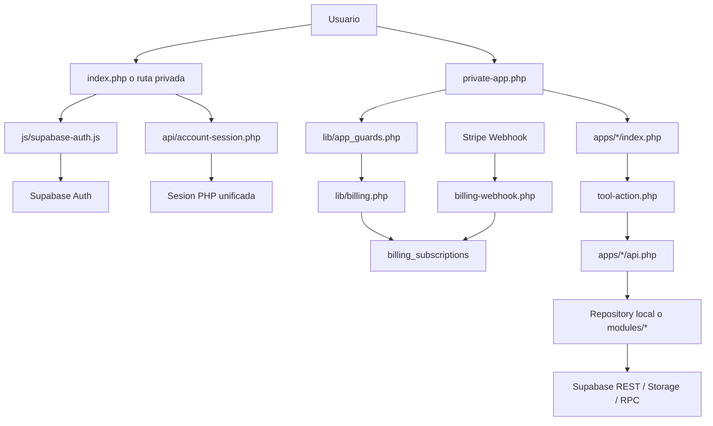

# Arquitectura de `aiscalercenter.com`

## Resumen ejecutivo

Este proyecto es una plataforma web híbrida construida principalmente en **PHP + JavaScript modular**, con **Supabase** como backend gestionado para autenticación, base de datos, storage y parte del tiempo real.

La arquitectura combina 5 piezas principales:

1. **Sitio público y PWA**: landing, login, blog, formularios públicos y landings públicas.
2. **Cuenta ASX y billing**: sesión unificada, guard de suscripción y páginas de cuenta/facturación.
3. **Apps privadas por ruta**: entrypoints directos como `/formularios`, `/landings`, `/tableros`, etc.
4. **Panel autenticado legado**: una SPA ligera montada sobre `index.php?view=app`, todavía activa como fallback transicional.
5. **Módulos de dominio**: lógica histórica organizada por capacidades (`forms`, `landing-pages`, `task-boards`, `whatsapp-bots`, `research`, etc.), en proceso de migración hacia `apps/`.

No hay señales de un build moderno con `package.json` o `composer.json`; el proyecto carga dependencias frontend vía **CDN/ESM** y compone el backend con `require_once`, funciones globales y clases repositorio.

## Estado actual de migración

La base ya no depende exclusivamente del launcher del panel. El proyecto ahora tiene una **arquitectura híbrida transicional**:

- **Nuevo flujo principal**:
  - `private-app.php` resuelve acceso privado por app.
  - `account.php` centraliza cuenta, suscripción y facturación.
  - `lib/account_session.php`, `lib/billing.php`, `lib/private_apps.php` y `lib/app_guards.php` forman el nuevo kernel transversal.
- **Compatibilidad temporal**:
  - `modules/tools/bootstrap.php`, `tool.php` y `tool-action.php` siguen activos para no romper apps que aún dependen del runtime anterior.
  - `private-app.php` crea contexto compatible (`launch_token`) para reutilizar assets y APIs mientras se termina el desacople.
- **Apps ya encaminadas al nuevo modelo**:
  - `apps/form-generator/` ya tiene `bootstrap.php` y `Repository.php` locales.
  - `apps/landing-builder/` ya tiene `bootstrap.php` y `Repository.php` locales.
  - `form.php` y `landing.php` ya consumen esos bootstraps locales en vez de `modules/`.

---

## Vista general por capas

### 1. Capa de entrada web

Archivos principales:

- `index.php`: shell principal del sitio. Resuelve `landing`, `login` y `app`.
- `account.php`: shell privada de cuenta, suscripción y facturación.
- `private-app.php`: shell privada por app con auth guard y billing guard.
- `blog.php`: render público del blog.
- `form.php`: render público de formularios.
- `landing.php`: render público de landing pages.
- `tool.php`: shell protegida para abrir herramientas tipo `php_folder`.
- `tools-browser.php`: catálogo/navegador HTML de herramientas.
- `tool-action.php`: proxy seguro hacia `apps/*/api.php`.
- `tool-render.php`: render parcial de `apps/*/partial.php` cuando existe.
- `lead-intake.php`: endpoint público para ingreso de leads.
- `whatsapp-webhook.php`: webhook público para bots de WhatsApp.

La reescritura de URLs depende de `.htaccess`, que además segmenta rutas por host:

- `aiscaler.asx.mx` para la app principal
- `f.asx.mx` para formularios públicos
- `p.asx.mx` para landings públicas

Rutas privadas ya declaradas:

- `/cuenta`, `/cuenta/suscripcion`, `/cuenta/facturacion`
- `/formularios`, `/landings`, `/tableros`, `/seguimiento-clientes`, `/bots-whatsapp`
- `/planificador-publicaciones`, `/google`, `/youtube`, `/mercado-libre`, `/amazon`
- `/ai-image-studio`, `/semaforo-trafico`, `/termometro-cpl`, `/auditor-campanas`
- `/rastreador-inteligente`, `/vision-rayos-x`, `/conecta`

### 2. Capa de presentación frontend

Frontend principal:

- `js/panel-app.js`: runtime del panel autenticado.
- `js/supabase-auth.js`: inicializa Supabase Auth en navegador y maneja login/sesión.
- `js/account-shell.js`: sincroniza sesión cliente/servidor para cuenta y apps privadas.
- `js/shared/*`: utilidades UI y storage compartidas.
- `js/modules/*`: módulos de secciones del panel.
- `css/modules/*`: estilos por módulo.

Patrón del panel:

- `index.php` renderiza la carcasa HTML/CSS.
- `js/panel-app.js` actúa como orquestador de secciones.
- Cada sección del panel se implementa como un módulo JS con interfaz del tipo:
  - `renderSection(...)`
  - `bind()`
  - métodos auxiliares de carga/acción

### 3. Capa de cuenta y billing

Archivos principales:

- `lib/account_session.php`: sesión PHP unificada para cuenta ASX.
- `lib/billing.php`: estado de suscripción, Checkout, Portal y webhook sync.
- `lib/private_apps.php`: registro de apps privadas y resolución de workspace.
- `lib/app_guards.php`: contratos `requireAuthenticatedAccount()`, `requireAppAccess()` y `requireWriteAccess()`.
- `api/account-session.php`: sincroniza sesión web con PHP.
- `api/billing.php`: expone estado de billing, checkout y portal.
- `billing-webhook.php`: sincroniza Stripe -> tablas locales.
- `config/stripe.php`: configuración del plan `ecosistema_asx`.

Responsabilidad:

- autenticar al usuario con Supabase Auth
- resolver si entra, entra en modo lectura o debe reactivar
- mantener a Stripe como fuente de verdad del estado de suscripción

### 4. Capa de herramientas y compatibilidad

Hay dos modos de herramientas:

#### A. `php_folder`

Cada herramienta vive en `apps/<slug-carpeta>/` y normalmente expone:

- `tool.php`: metadata y configuración de lanzamiento
- `index.php`: UI principal
- `api.php`: acciones protegidas
- `app.js`: comportamiento frontend
- `style.css`: estilos
- `partial.php`: vista embebible opcional

Flujo:

1. El panel pide abrir una herramienta vía `api/tools.php?action=launch`.
2. PHP genera un `launch_token` y guarda contexto seguro en sesión (`modules/tools/bootstrap.php`).
3. El navegador abre `tool.php?launch=...`.
4. `tool.php` monta la shell, carga el `index.php` de la app y le inyecta contexto.
5. Las acciones de la app pasan por `tool-action.php`, que resuelve `apps/<app>/api.php`.

#### B. `panel_module`

Algunas herramientas no abren una miniapp PHP aislada, sino un módulo JS interno del panel.

Ejemplo detectado:

- `apps/social-post-scheduler/tool.php` usa `launch_mode = panel_module`
- El runtime se resuelve en `js/modules/tools/runtime.js`

Este modo evita shell extra y reutiliza el estado del panel.

### 5. Capa de dominio / negocio

La lógica del negocio vive en dos zonas:

- `apps/*`: destino objetivo de cada dominio autocontenido
- `modules/*`: soporte legado todavía reutilizado por varias apps

Áreas históricas en `modules/`:

- `modules/forms`
- `modules/landing-pages`
- `modules/task-boards`
- `modules/customer-follow-up`
- `modules/whatsapp-bots`
- `modules/analytics`
- `modules/connect`
- `modules/research`
- `modules/ai-images`
- `modules/tools`

Patrón común:

- `bootstrap.php`: wiring, helpers, normalización de errores y utilidades de serialización.
- `*Repository.php`: acceso a Supabase REST.
- clases `Service` o `Provider` cuando el dominio lo requiere.

### 6. Capa de integración e infraestructura

Archivos clave:

- `lib/supabase_api.php`: wrapper común para Auth REST y PostgREST.
- `lib/app_routing.php`: construcción de URLs y resolución de host/subdominio.
- `lib/app_storage.php`: helpers para rutas y URLs de storage en Supabase.
- `lib/pwa.php`: helpers para manifiesto y registro PWA.

Configuración:

- `config/supabase.php`
- `config/panel.php`
- `config/domains.php`
- `config/connect.php`
- `config/research.php`
- `config/storage.php`
- `config/ai_images.php`

Persistencia declarativa:

- `supabase/*.sql`: esquemas, storage setup y funciones necesarias para cada dominio.
- `supabase/account_billing_schema.sql`: workspaces por app, clientes/suscripciones/eventos de billing.

---

## Flujo arquitectónico principal



### Flujo de autenticación y panel

1. `index.php` construye el shell y publica configuración de Supabase al frontend.
2. `js/supabase-auth.js` crea el cliente de `@supabase/supabase-js`.
3. `js/panel-app.js` arranca el panel, valida sesión y sincroniza el token hacia PHP con `api/tools-session.php`.
4. Esa sesión PHP permite que el sistema de herramientas opere sin exponer tokens en query params.

### Flujo de apps privadas

1. El usuario entra directo a `/formularios`, `/landings`, `/tableros`, etc.
2. `.htaccess` envía la petición a `private-app.php`.
3. `private-app.php` exige sesión, consulta billing y resuelve el workspace local de esa app.
4. Si la cuenta está en `active` o `trialing`, la app entra con lectura y escritura.
5. Si la cuenta está en `past_due`, `unpaid`, `canceled` o `incomplete_expired`, la app entra en modo lectura con banner persistente.
6. Para compatibilidad, `private-app.php` sigue generando `launch_token` interno cuando la app todavía depende de assets o APIs del runtime anterior.

### Flujo de herramientas legado

1. El usuario entra a una sección del panel.
2. `js/modules/tools-catalog/index.js` carga el catálogo desde `tools-browser.php`.
3. Al abrir una herramienta, `api/tools.php` valida sesión, busca metadata en `apps/*/tool.php` y genera un `launch_token`.
4. `tool.php` usa ese token para resolver la app real y montar su HTML.
5. Las llamadas seguras a la app usan `tool-action.php`, que resuelve el `api.php` de esa herramienta.

### Flujo de persistencia

1. Las apps y módulos llaman repositorios PHP.
2. Los repositorios usan `supabaseRestRequest()` y `supabaseAuthRequest()`.
3. Los esquemas SQL en `supabase/` definen tablas, índices, funciones RPC y políticas esperadas por cada módulo.

---

## Mapa de carpetas

```text
.
├── api/                      # Endpoints JSON del panel y de integraciones del shell
│   ├── account-session.php
│   ├── billing.php
│   ├── connect.php
│   ├── research.php
│   ├── tools.php
│   └── tools-session.php
├── apps/                     # Herramientas lanzables
│   ├── ai-image-studio/
│   ├── amazon/
│   ├── auditor-campanas/
│   ├── cpl-termometro/
│   ├── customer-follow-up/
│   ├── form-generator/
│   ├── google/
│   ├── landing-builder/
│   ├── mercado-libre/
│   ├── rastreador-inteligente/
│   ├── social-post-scheduler/
│   ├── task-boards/
│   ├── traffic-semaforo/
│   ├── vision-rayos-x/
│   ├── whatsapp-bots/
│   └── youtube/
├── config/                   # Configuración de dominios, panel, Supabase y proveedores
│   ├── stripe.php
├── css/
│   └── modules/             # Estilos del panel por dominio
├── img/                      # Logos, iconos, assets PWA
├── js/
│   ├── modules/             # Módulos SPA del panel
│   ├── account-shell.js     # Shell de cuenta y apps privadas
│   ├── shared/              # Helpers compartidos
│   ├── panel-app.js         # Runtime principal del panel
│   ├── supabase-auth.js     # Auth del frontend
│   ├── tool-runtime.js      # Runtime embebido para panel_module
│   └── pwa-register.js
├── lib/                      # Infraestructura común PHP
│   ├── account_session.php
│   ├── app_guards.php
│   ├── app_routing.php
│   ├── app_storage.php
│   ├── billing.php
│   ├── pwa.php
│   ├── private_apps.php
│   └── supabase_api.php
├── modules/                  # Lógica de dominio y acceso a datos
│   ├── ai-images/
│   ├── analytics/
│   ├── connect/
│   ├── customer-follow-up/
│   ├── forms/
│   ├── landing-pages/
│   ├── research/
│   ├── task-boards/
│   ├── tools/
│   └── whatsapp-bots/
├── storage/                  # Soporte local/temporal de archivos
├── supabase/                 # Esquemas SQL, buckets y funciones esperadas
│   ├── account_billing_schema.sql
├── .htaccess                 # Reescritura por host/ruta
├── account.php               # Shell privada de cuenta
├── billing-webhook.php       # Webhook de Stripe
├── index.php                 # Entrada principal
├── private-app.php           # Shell privada por app
├── tool.php                  # Shell protegida de herramientas
├── tools-browser.php         # Catálogo HTML de herramientas
├── tool-action.php           # Proxy seguro a apps/*/api.php
├── tool-render.php           # Render parcial seguro
├── form.php                  # Frontend público de formularios
├── landing.php               # Frontend público de landings
├── lead-intake.php           # Endpoint público de leads
├── whatsapp-webhook.php      # Webhook público de WhatsApp
├── manifest.php              # Manifest PWA
└── sw.js                     # Service Worker
```

---

## Qué hace cada zona importante

### `apps/`

Es la capa de producto visible para el usuario. Cada carpeta representa una herramienta funcional.

Dirección objetivo:

- cada app debe vivir con `index.php`, `api.php`, `app.js`, `style.css`, `bootstrap.php` y su repositorio propio
- el kernel no debe conocer reglas de negocio, solo auth, billing, routing y workspace
- `form-generator` y `landing-builder` ya dieron el primer paso con bootstrap y repositorio locales

Patrón típico dentro de una app:

```text
apps/<tool>/
├── tool.php      # Registro/metadata de la herramienta
├── index.php     # Vista principal
├── api.php       # Acciones protegidas
├── app.js        # Lógica cliente
├── style.css     # Estilos propios
└── partial.php   # Vista embebida opcional
```

Casos destacados:

- `task-boards`: tablero Kanban colaborativo con realtime.
- `customer-follow-up`: pipeline comercial y entrada de leads.
- `landing-builder`: constructor de landings y publicación pública.
- `form-generator`: formularios públicos + respuestas + tracking.
- `whatsapp-bots`: bots, inbox humana y webhook.
- `social-post-scheduler`: ejemplo de herramienta resuelta como `panel_module`.

### `modules/`

Es la capa reusable del backend. Aquí está la lógica que de verdad “sabe” del negocio.

Ejemplos:

- `modules/task-boards/TaskBoardRepository.php`: CRUD del tablero contra Supabase.
- `modules/research/ResearchService.php`: orquesta proveedores de investigación.
- `modules/connect/*Provider.php`: proveedores OAuth y de conexiones sociales.
- `modules/forms/FormRepository.php`: formularios públicos y respuestas.

### `js/modules/`

Es la capa SPA del panel. Aquí viven:

- administración del blog
- proyectos
- cursos
- conecta
- investigar
- ejecutar
- catálogo de herramientas
- configuración del proyecto

Cada módulo se monta bajo el shell del panel y, en general, conversa con Supabase directamente o con endpoints PHP específicos.

### `supabase/`

Aquí está el contrato real de persistencia del sistema. Los archivos SQL definen:

- tablas
- índices
- funciones públicas/RPC
- políticas esperadas
- buckets y setup de storage

Este directorio es crítico: muchos mensajes de error de `bootstrap.php` remiten explícitamente a ejecutar esos SQL cuando faltan tablas o funciones.

---

## Dependencias principales

## Dependencias externas

### Backend / infraestructura

- **PHP** como runtime principal.
- **cURL** desde `lib/supabase_api.php` para consumir APIs de Supabase.
- **Apache + mod_rewrite** inferido por `.htaccess`.
- **Sesiones PHP** para proteger el lanzamiento de herramientas.

### Backend gestionado

- **Supabase Auth** para login, recuperación y validación de sesión.
- **Supabase PostgREST** para CRUD sobre tablas.
- **Supabase Storage** para archivos públicos/privados.
- **Supabase Realtime** usado desde algunas apps, por ejemplo `task-boards`.

### Frontend cargado por CDN/ESM

- **`@supabase/supabase-js@2`** vía `https://esm.sh/`.
- **Tailwind CSS CDN** en el shell principal.
- **Google Fonts**.
- **Material Symbols Rounded**.
- **Font Awesome**.

### Integraciones externas configurables

- **Google Custom Search / Google APIs** para investigación.
- **YouTube Data API**.
- **Mercado Libre**.
- **Amazon Product Advertising API**.
- **OAuth de Facebook, Instagram, LinkedIn y Google** en `config/connect.php`.
- **Proveedor de generación de imágenes** en `config/ai_images.php`.
- **Webhook de WhatsApp Business** en `whatsapp-webhook.php`.

## Dependencias internas clave

- `lib/app_routing.php`
- `lib/supabase_api.php`
- `lib/app_storage.php`
- `modules/tools/bootstrap.php`
- `js/panel-app.js`
- `js/supabase-auth.js`
- `js/modules/tools-catalog/index.js`
- `js/modules/tools/runtime.js`

Estas piezas forman el “esqueleto” del sistema y son compartidas por muchas secciones.

---

## Patrones arquitectónicos importantes

### 1. Metadata por archivo en vez de registro en BD

Las herramientas ya no se registran por CRUD en base de datos. Se descubren leyendo `apps/*/tool.php`.

Ventaja:

- el catálogo está versionado en Git
- el alta/baja de herramientas es declarativo

Implicación:

- para agregar una herramienta nueva, hay que crear carpeta en `apps/` y su `tool.php`

### 2. BFF ligera en PHP

PHP actúa como una especie de **Backend for Frontend**:

- protege sesión
- compone vistas
- normaliza errores
- enruta hacia Supabase
- encapsula integraciones y webhooks

No es un backend de dominio totalmente separado; es una capa fina pero muy central.

### 3. Dominio repartido entre PHP y JS

La lógica no está concentrada en un solo lado:

- el estado de interfaz vive en JS
- la persistencia y validación operativa viven en PHP
- Supabase hace de backend persistente

Eso vuelve importante documentar bien los contratos entre:

- `apps/*/app.js`
- `apps/*/api.php`
- `modules/*Repository.php`
- `supabase/*.sql`

### 4. Arquitectura orientada a “tool workspace”

El producto está diseñado alrededor del concepto de proyecto + categoría + herramienta.

Jerarquía funcional:

1. Usuario autenticado
2. Proyecto activo
3. Sección del panel
4. Herramienta o módulo
5. Persistencia en Supabase

---

## Rutas y superficies del sistema

### Superficies públicas

- `/` o `index.php`
- `/login`
- `/app`
- `/blog/:slug`
- formularios públicos vía `form.php` o subdominio `f.*`
- landings públicas vía `landing.php` o subdominio `p.*`
- `lead-intake.php`
- `whatsapp-webhook.php`

### Superficies autenticadas

- panel SPA
- catálogo de herramientas
- herramientas `php_folder`
- módulos `panel_module`

---

## PWA y caching

La app tiene soporte PWA:

- `manifest.php` genera el manifiesto dinámicamente.
- `sw.js` precachea rutas base y assets.
- el service worker excluye rutas sensibles como:
  - `api/`
  - `tool-action.php`
  - `tool-asset.php`
  - `whatsapp-webhook.php`

Esto sugiere una estrategia correcta: cachear navegación y assets, pero no endpoints mutables o sensibles.

---

## Áreas con mayor acoplamiento

Estas son las piezas más centrales y, por tanto, las más sensibles a cambios:

- `index.php` + `js/panel-app.js`
- `js/supabase-auth.js`
- `modules/tools/bootstrap.php`
- `api/tools.php`
- `tool.php`, `tool-action.php`, `tool-render.php`
- `lib/supabase_api.php`
- los archivos SQL de `supabase/`

Cambios aquí tienen impacto transversal.

---

## Riesgos y observaciones técnicas

- La arquitectura es clara en intención, pero **muy basada en convenciones** de carpetas y nombres de archivo.
- Al no haber `composer.json` ni `package.json`, la gestión de dependencias y versionado de librerías depende más del código fuente y de URLs CDN.
- Hay bastante lógica compartida en funciones globales PHP; eso acelera desarrollo, pero puede dificultar testing y aislamiento.
- Los contratos de datos dependen fuertemente de Supabase y de que los SQL de `supabase/` estén aplicados correctamente.
- El sistema de herramientas está bien encapsulado, pero concentra bastante responsabilidad en la sesión PHP y los launch tokens.

---

## Recomendaciones para orientarse rápido en el código

Si quieres entender el sistema de arriba hacia abajo, este es el mejor orden:

1. `index.php`
2. `js/supabase-auth.js`
3. `js/panel-app.js`
4. `config/panel.php`
5. `modules/tools/bootstrap.php`
6. `api/tools.php`
7. `tool.php`
8. una herramienta representativa como `apps/task-boards/`
9. su módulo backend correspondiente en `modules/task-boards/`
10. el SQL asociado en `supabase/task_boards_schema.sql`

---

## Resumen final

La arquitectura está organizada alrededor de un **shell PHP + panel JS + dominios respaldados por Supabase + herramientas desacopladas por carpeta**. La separación entre `apps/`, `modules/`, `lib/`, `js/modules/` y `supabase/` está bastante bien marcada y permite crecer el producto por capacidades.

La idea principal del proyecto es:

- **PHP** orquesta, protege y renderiza
- **JS** controla la experiencia interactiva
- **Supabase** persiste y autentica
- **`apps/*`** entrega herramientas concretas al usuario
- **`modules/*`** encapsula la lógica de negocio reutilizable

Si más adelante quieres, el siguiente paso natural es que te prepare también una **segunda versión de este documento con diagramas por flujo**:

- autenticación
- lanzamiento de herramientas
- formularios públicos
- task boards / realtime
- WhatsApp bots / webhooks
